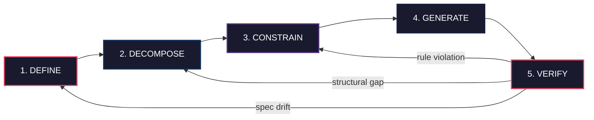

# Spec-Driven Development: A Practitioner's Reference

A practical framework for writing specifications that produce reliable, maintainable code from AI coding agents.

## Who This Is For

- **Developers** using AI coding agents who want better output quality
- **Engineering leads** establishing AI-assisted development standards
- **Teams** transitioning from ad-hoc prompting to structured AI workflows
- **Anyone** who has been burned by "vibe coding" and wants a systematic approach

## The Problem in Numbers

> **The quality gap between prompted and specified AI code is measurable -- and growing.**
>
> - **1.7x** more issues in AI-generated code vs human-written (CodeRabbit, Dec 2025)
> - **45%** of AI-generated code contains security flaws (Veracode, 2026)
> - **110,000+** AI-introduced issues surviving in production repositories (arXiv, Mar 2026)
> - **46%** of developers actively distrust AI output accuracy
> - **20%** of AI-generated code references hallucinated (non-existent) packages

These are not hypothetical risks. Every statistic above comes from published research within the last twelve months. SDD addresses these by making AI code generation deterministic, verifiable, and traceable.

## The SDD Lifecycle Model

Spec-Driven Development follows a 5-phase lifecycle. Each phase answers a distinct question, produces a concrete artifact, and assigns clear ownership between human and AI. The lifecycle is not strictly linear: verification failures feed back into earlier phases to correct drift before it compounds.

The core thesis: **the spec is the maintained artifact; code is generated from it.** When verification reveals a gap, you fix the spec and regenerate -- you never patch around a specification failure.

## Phase Summary Matrix

Each phase links to a detailed document covering practices, outputs, and failure modes.

| Phase | Question Answered | Key Output | Common Failure | Deep Dive |
|-------|-------------------|------------|----------------|-----------|
| [1. Define](kb/docs/02-defining-requirements.md) | What and why? | Requirements doc, success criteria | Vague or missing spec | [Why SDD](kb/docs/00-why-sdd.md), [Defining Requirements](kb/docs/02-defining-requirements.md) |
| [2. Decompose](kb/docs/03-decomposition-and-design.md) | How to structure? | Interfaces, data models, task boundaries | Monolithic generation | [Decomposition & Design](kb/docs/03-decomposition-and-design.md) |
| [3. Constrain](kb/docs/04-constraints-and-guardrails.md) | What are the boundaries? | Standards, rules, budgets, "never do" lists | No guardrails | [Constraints & Guardrails](kb/docs/04-constraints-and-guardrails.md) |
| [4. Generate](kb/docs/05-generation-and-context.md) | Build it | Code from spec | Poor context engineering | [Generation & Context](kb/docs/05-generation-and-context.md) |
| [5. Verify](kb/docs/06-verification-and-validation.md) | Does it match the spec? | Test results, compliance report | Skipping verification | [Verification & Validation](kb/docs/06-verification-and-validation.md) |

## Quick Start

Not sure where to begin? The top 10 actions you can take today to improve AI-generated code quality:

1. Write requirements before prompting -- even 5 sentences anchors the AI to your intent
2. Define interfaces before internals -- type signatures and API schemas first
3. Set up project instructions (`CLAUDE.md`, `.cursorrules`, `.github/copilot-instructions.md`)
4. Include "never do" rules -- libraries to avoid, prohibited patterns, security constraints
5. Use Plan Mode for exploration before committing to implementation
6. Decompose large features into focused tasks of <200 LOC each
7. Include test criteria in every spec -- "Verify: [specific testable condition]"
8. Generate tests before implementation -- tests define expected behavior
9. Verify every generation against the spec -- mark requirements as met/unmet
10. Update specs when reality diverges -- fix the spec first, then regenerate

See **[checklists/quickstart.md](kb/checklists/quickstart.md)** for the full annotated checklist with implementation guidance.

## Tool-Specific Guides

Each guide covers the agent's spec workflow, project configuration, and recommended SDD settings.

- **[Claude Code](kb/checklists/claude-code.md)** -- Plan Mode, `CLAUDE.md`, hooks, permission scopes
- **[Cursor](kb/checklists/cursor.md)** -- `.cursorrules`, `@file` context, Agent Mode, rule files
- **[GitHub Copilot](kb/checklists/github-copilot.md)** -- spec-kit, constitution files, Agent Mode, policy controls

## SDD Frameworks

- **[OpenSpec](kb/docs/appendix-openspec.md)** -- lightweight, brownfield-first, delta specs for iterative development
- **[BMAD-METHOD](kb/docs/appendix-bmad-method.md)** -- multi-agent personas, agent-as-code, systematic agile AI workflows
- **[Full Comparison](kb/docs/appendix-tool-comparison.md)** -- frameworks, IDEs, and toolkits compared by project type and team size

## Additional Topics

- [Spec Types and When to Use Each](kb/docs/07-spec-types.md) -- choosing the right specification format
- [SDD Anti-Patterns](kb/docs/08-anti-patterns.md) -- common mistakes and how to avoid them
- [Measuring SDD Effectiveness](kb/docs/09-measuring-effectiveness.md) -- metrics that show whether SDD is working
- [SDD and the Software Development Lifecycle](kb/docs/10-sdd-and-sdlc.md) -- integrating SDD into existing processes
- [SDD Lifecycle Deep Dive](kb/docs/01-sdd-lifecycle.md) -- full lifecycle documentation with phase ownership

## Further Reading

Key references that informed this framework:

- [Thoughtworks: Spec-Driven Development](https://www.thoughtworks.com/en-us/insights/blog/generative-ai/spec-driven-development-ai-coding) -- the original articulation of SDD as a discipline
- [Addy Osmani: How to Write a Good Spec](https://addyosmani.com/blog/good-spec/) -- practical guidance on specification quality
- [Martin Fowler: AI-Native Development Tools](https://martinfowler.com/articles/exploring-gen-ai.html#memo-14) -- analysis of spec-driven tooling and context engineering
- [GitHub Blog: Spec-Kit Launch](https://github.blog/changelog/2025-07-22-github-copilot-coding-agent-now-supports-spec-based-development/) -- GitHub's specification toolkit for Copilot
- [Martin Fowler: Context Engineering for Coding Agents](https://martinfowler.com/articles/exploring-gen-ai/context-engineering-coding-agents.html) -- how context shapes AI agent output quality
- [InfoQ: Spec-Driven Development at Enterprise Scale](https://www.infoq.com/articles/enterprise-spec-driven-development/) -- enterprise adoption patterns and lessons learned

## Contributing

Contributions are welcome. This is a living document -- the SDD landscape evolves rapidly, and community input keeps it current.

- Open an [issue](../../issues) to report inaccuracies, suggest new topics, or flag emerging practices
- Submit a pull request to improve existing guides or add tool-specific notes
- See individual docs for areas marked as needing expansion

## License

This work is licensed under the [Apache License 2.0](LICENSE).

You are free to use, modify, and distribute this material for any purpose, including commercial, provided you include the required notices and comply with the license terms.
