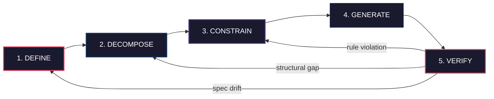

# SDD Lifecycle Model

Last verified: 2026-04-04

Spec-Driven Development follows a 5-phase lifecycle. Each phase answers a distinct question, produces a concrete artifact, and assigns clear ownership between human and AI actors. The lifecycle is not strictly linear: verification failures feed back into earlier phases to correct drift before it compounds.

## Mermaid Diagram



## ASCII Fallback

For terminals and environments that do not render Mermaid:

```
                          FORWARD FLOW
  ┌──────────┐   ┌──────────────┐   ┌─────────────┐   ┌────────────┐   ┌────────────┐
  │ 1.DEFINE │──>│ 2.DECOMPOSE  │──>│ 3.CONSTRAIN │──>│ 4.GENERATE │──>│  5.VERIFY  │
  │          │   │              │   │             │   │            │   │            │
  │ What &   │   │ How should   │   │ What are    │   │ Build it   │   │ Does it    │
  │ why?     │   │ it be        │   │ the         │   │            │   │ match the  │
  │          │   │ structured?  │   │ boundaries? │   │            │   │ spec?      │
  └──────────┘   └──────────────┘   └─────────────┘   └────────────┘   └─────┬──────┘
       ^                ^                  ^                                   │
       │                │                  │           FEEDBACK LOOPS          │
       │                │                  └──────────── rule violation ───────┤
       │                └───────────────── structural gap ────────────────────┤
       └──────────────────────────────── spec drift ──────────────────────────┘
```

## Phase Summary Table

| Phase | Question Answered | Key Output | Primary Actor |
|-------|-------------------|------------|---------------|
| 1. DEFINE | What are we building and why? | Requirements doc, success criteria | Human (with AI assistance) |
| 2. DECOMPOSE | How should it be structured? | Interface contracts, data models, component boundaries | Human + AI |
| 3. CONSTRAIN | What are the boundaries? | Coding standards, security rules, performance budgets, "never do" rules | Human |
| 4. GENERATE | Build it | Generated code | AI (from spec) |
| 5. VERIFY | Does it match the spec? | Test results, compliance report | AI + Human |

## Key Principle

> The feedback loops are the defining feature of SDD. Verification is not the end of the process -- it is the mechanism that keeps every prior phase honest. When VERIFY detects spec drift, the fix happens at the phase where the drift originated, not by patching generated code. **Correct the spec, then regenerate. Never patch around a specification failure.**
