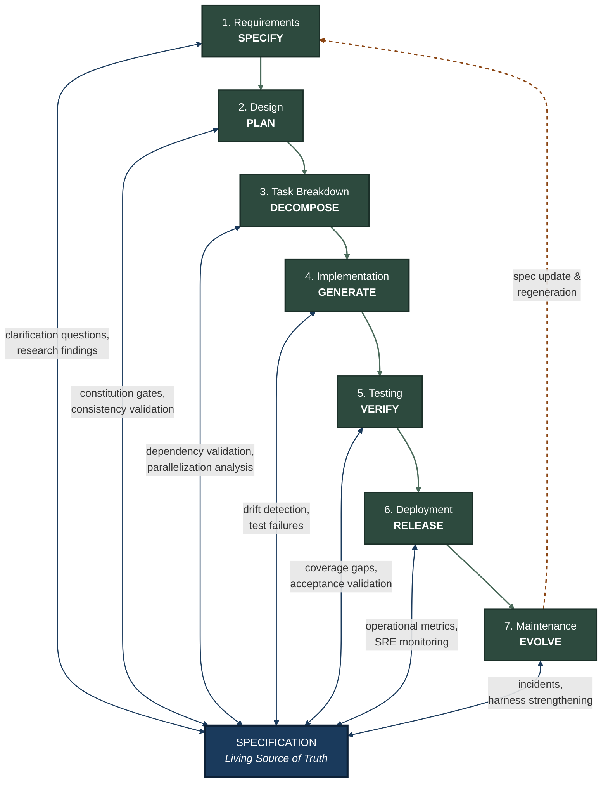

# SDD-SDLC Feedback Loop Model

Last verified: 2026-04-04

## Overview

SDD transforms the traditional SDLC by placing the specification at the center as a living source of truth, with continuous feedback loops at every phase replacing traditional end-of-phase gates. Instead of a linear waterfall where each phase hands off to the next, every phase reads from and writes back to the specification. Drift is detected early, corrections are cheap, and the spec always reflects ground truth.

## Mermaid Diagram



## ASCII Art Fallback

```
                        +--------------------------------------+
                        |          SPECIFICATION               |
                        |     (Living Source of Truth)         |
                        +--------------------------------------+
                          |    |    |    |    |    |    |
       clarification -----+    |    |    |    |    |    +----- incidents,
       questions,          |    |    |    |    |    |          harness
       research findings   |    |    |    |    |    |          strengthening
                           |    |    |    |    |    |
  +-------------+          |    |    |    |    |    |      +-------------+
  | 1. Require- |<---------+    |    |    |    |    +----->| 7. Mainten- |
  |    ments    |               |    |    |    |           |    ance     |
  |   SPECIFY   |               |    |    |    |           |   EVOLVE   |
  +------+------+               |    |    |    |           +------+------+
         |                      |    |    |    |                  ^
         v         constitution |    |    |    | operational      |
  +-------------+  gates,       |    |    |    | metrics,   +-----+-------+
  | 2. Design   |<--------------+    |    |    +----------->| 6. Deploy-  |
  |    PLAN     |                    |    |                 |    ment     |
  +------+------+                    |    |                 |   RELEASE  |
         |            dependency     |    |   coverage      +------+------+
         v            validation,    |    |   gaps,                ^
  +-------------+     paralleliz.    |    |   acceptance    +------+------+
  | 3. Task     |<-------------------+    +---------------->| 5. Testing  |
  |  Breakdown  |                    |                      |   VERIFY   |
  |  DECOMPOSE  |                    |                      +------+------+
  +------+------+       drift        |                             ^
         |              detection,   |                             |
         v              test         |                             |
  +-------------+       failures     |                      +------+------+
  | 4. Implement|<-------------------+                      |             |
  |   GENERATE  |---------------------------------------------->----------+
  +-------------+

  Maintenance ----( spec update & regeneration )----> Requirements
```

## Summary Table

| SDLC Phase | SDD Activity | Feedback Mechanism | What Flows Back to Spec |
|---|---|---|---|
| **Requirements** | SPECIFY | Clarification questions, research findings | Ambiguity resolutions, domain constraints, edge cases discovered during elicitation |
| **Design** | PLAN | Constitution gates, consistency validation | Architectural decisions, interface contracts, cross-cutting concern resolutions |
| **Task Breakdown** | DECOMPOSE | Dependency validation, parallelization analysis | Task granularity adjustments, sequencing constraints, shared-resource conflicts |
| **Implementation** | GENERATE | Drift detection, test failures | API shape corrections, behavioral clarifications, constraint refinements |
| **Testing** | VERIFY | Coverage gaps, acceptance validation | Missing acceptance criteria, untested invariants, boundary conditions |
| **Deployment** | RELEASE | Operational metrics, SRE monitoring | Performance baselines, resource requirements, rollback conditions |
| **Maintenance** | EVOLVE | Incidents, harness strengthening | Bug-driven spec patches, new regression tests, operational hardening rules |
