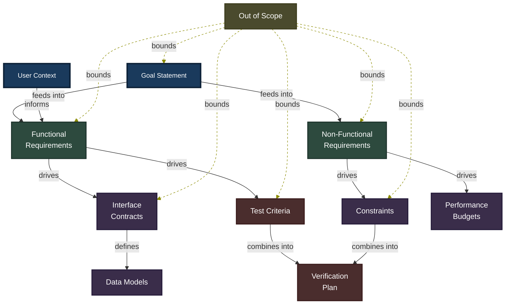

# Anatomy of a Well-Formed Spec

Last verified: 2026-04-04

A well-formed specification is not a flat document -- it is a directed graph of interdependent sections. The goal statement feeds into requirements, requirements drive contracts and test criteria, and an explicit "out of scope" section bounds everything. Understanding this structure helps you write specs that are complete, consistent, and verifiable by both humans and AI.

## Mermaid Diagram



## ASCII Fallback

For terminals and environments that do not render Mermaid:

```
                     +-----------------+         +----------------+
                     |  Goal Statement |         |  User Context  |
                     +--------+--------+         +-------+--------+
                              |                          |
                  +-----------+-----------+              |
                  |                       |    informs   |
                  v                       v              |
         +--------+--------+    +---------+---------+    |
         |   Functional    |<---+   Non-Functional  |    |
         |  Requirements   |    |   Requirements    |    |
         +---+--------+----+    +----+----------+---+    |
             |        |              |          |        |
          drives    drives        drives     drives      |
             |        |              |          |        |
             v        v              v          v        |
        +----+---+ +--+-------+ +---+------+ +-+--------+-+
        |Interface| |  Test    | |Constraints| |Performance|
        |Contracts| | Criteria | |          | |  Budgets  |
        +----+----+ +----+----+ +-----+----+ +-----------+
             |            |           |
          defines     combines     combines
             |          into        into
             v            |           |
        +----+----+       v           |
        |  Data   |  +---+-----------+--+
        | Models  |  | Verification     |
        +---------+  |     Plan         |
                     +------------------+

    . . . . . . . . . . . . . . . . . . . . . . . . . . .
    :                  Out of Scope                       :
    :   (bounds all sections -- defines what is NOT       :
    :    part of this spec)                               :
    . . . . . . . . . . . . . . . . . . . . . . . . . . .
```

## Section Reference Table

| Section | Purpose | Required? | Typical Size |
|---------|---------|-----------|--------------|
| **Goal Statement** | What and why in 1-2 sentences | Yes | 50-100 words |
| **User Context** | Who needs this and their situation | Yes | 50-150 words |
| **Functional Requirements** | What the system must do | Yes | 200-800 words |
| **Non-Functional Requirements** | Performance, security, accessibility | Recommended | 100-300 words |
| **Success Criteria** | Testable acceptance conditions | Yes | 100-300 words |
| **Interface Contracts** | API schemas, type signatures | For multi-component | 200-500 words |
| **Constraints** | Coding standards, "never do" rules | Recommended | 100-300 words |
| **Out of Scope** | Explicit boundaries | Yes | 50-150 words |
| **Open Questions** | Unresolved [NEEDS CLARIFICATION] items | As needed | Variable |

## Quality Checklist

Before feeding a spec to an AI agent, validate it against these questions:

- [ ] **Is every requirement testable?** Each functional requirement should map to at least one concrete pass/fail criterion. If you cannot describe how to test it, the requirement is too vague.
- [ ] **Are interfaces explicitly defined?** Every boundary between components -- API endpoints, function signatures, data shapes -- should have an unambiguous contract. Do not leave the AI to infer schemas.
- [ ] **Is scope bounded?** The "Out of Scope" section must exist and explicitly name what this spec does *not* cover. Unbounded specs invite unbounded implementations.
- [ ] **Does it fit in <8K tokens?** A spec that exceeds a single context window forces the AI to work from partial information. If it is too long, decompose it into smaller specs with clear interface contracts between them.
- [ ] **Are examples included for ambiguous behaviors?** Wherever a requirement could be interpreted multiple ways, provide a concrete input/output example that resolves the ambiguity.
- [ ] **Are "never do" rules explicit?** Critical prohibitions (e.g., "never expose raw SQL errors to the client", "never mutate global state") must be stated directly. AI agents treat silence as permission.
